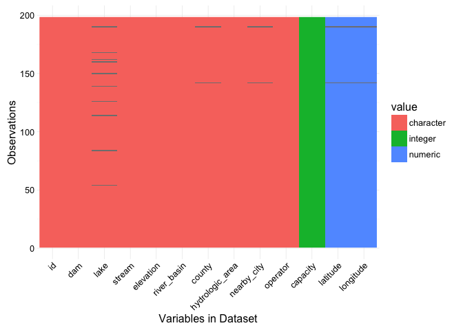
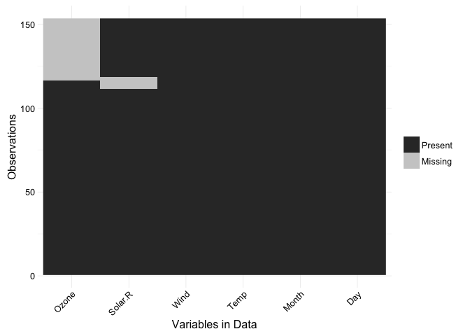
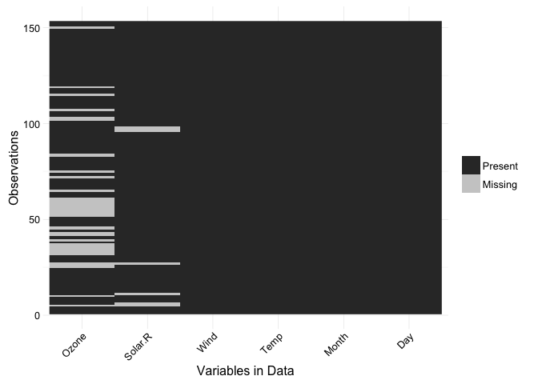
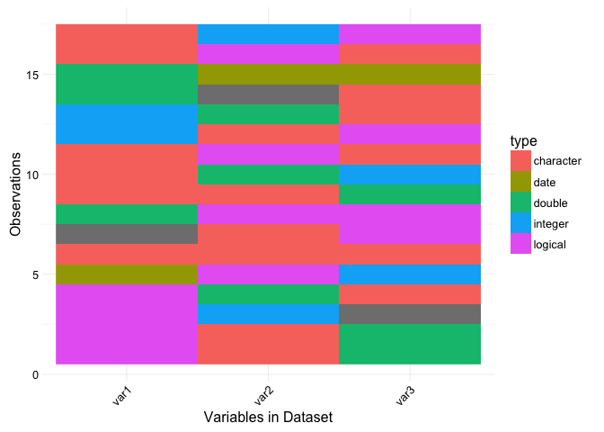
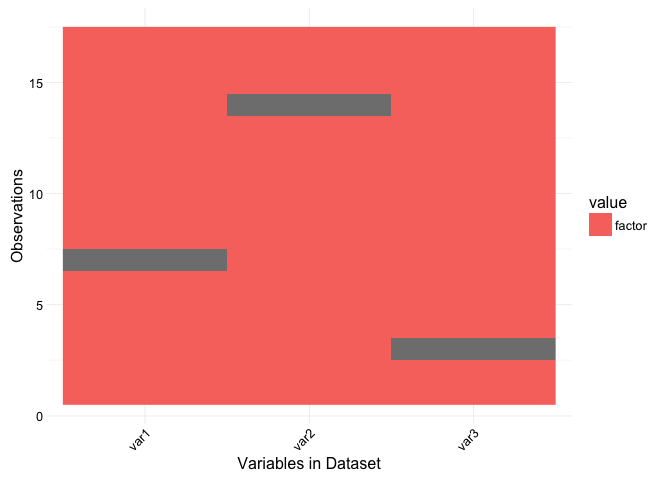

<!-- README.md is generated from README.Rmd. Please edit that file -->
visdat
======

What does visdat do?
====================

Initially inspired by [`csv-fingerprint`](https://github.com/setosa/csv-fingerprint), `vis_dat` helps you visualise a dataframe and "get a look at the data" by displaying the variable classes in a dataframe as a plot with `vis_dat`, and getting a brief look into missing data patterns `vis_miss`.

The name `visdat` was chosen as I think in the future it could be integrated with [`testdat`](https://github.com/ropensci/testdat). The idea being that first you visualise your data (`visdat`), then you run tests from `testdat` to fix them.

There are currently two main commands: `vis_dat` and `vis_miss`.

-   `vis_dat` visualises a dataframe showing you what the classes of the columns are, and also displaying the missing data.

-   `vis_miss` visualises just the missing data, and allows for missingness to be clustered and columns rearranged. `vis_miss` is similar to `missing.pattern.plot` from the `mi` package. Unfortunately `missing.pattern.plot` is no longer in the `mi` package (well, as of 14/02/2016).

-   **new!!** `vis_guess` has a guess at what the value of each cell. So "10.1" will return "double", and `10.1` will return "double", and 01/01/01 will return "date". Keep in mind that it is a **guess** at what each cell is, so you can't trust this fully. `vis_guess` is made possible thanks to Hadley Wickham's `readr` package - thanks mate!

How to install
==============

``` r
# install.packages("devtools")

library(devtools)

install_github("tierneyn/visdat")
```

Example
=======

Let's see what's inside the dataset `airquality`

``` r
library(visdat)

vis_dat(airquality)
```


The classes are represented on the legend, and missing data represented by grey.

by default, `vis_dat` sorts the columns according to the type of the data in the vectors. You can turn this off by setting `sort_type == FALSE`. This feature is better illustrated using the `example2` dataset, borrowed from csv-fingerprint.

``` r


vis_dat(example2)
```



``` r


vis_dat(example2, 
        sort_type = FALSE)
```


The plot above tells us that R reads this dataset as having numeric and integer values, along with some missing data in `Ozone` and `Solar.R`.

We can explore the missing data further using `vis_miss`

``` r

vis_miss(airquality)
```


You can cluster the missingness by setting `cluster = TRUE`

``` r

vis_miss(airquality, 
         cluster = TRUE)
```



The columns can also just be arranged by columns with most missingness, by setting `sort_miss = TRUE`.

``` r

vis_miss(airquality,
         sort_miss = TRUE)
```



`vis_guess` takes a guess at what each cell is. It's best illustrated using some messy data, which we'll make here.

``` r

messy_vector <- c(TRUE,
                  T,
                  "TRUE",
                  "T",
                  "01/01/01",
                  "01/01/2001",
                  NA,
                  NaN,
                  "NA",
                  "Na",
                  "na",
                  "10",
                  10,
                  "10.1",
                  10.1,
                  "abc",
                  "$%TG")

messy_df <- data.frame(var1 = messy_vector,
                       var2 = sample(messy_vector),
                       var3 = sample(messy_vector))
```

``` r

vis_guess(messy_df)
```



So here we see that there are many different kinds of data in your dataframe. As an analyst this might be a depressing finding. Compare this to `vis_dat`.

``` r

vis_dat(messy_df)
```



Where you'd just assume your data is wierd because it's all factors - or worse, not notice that this is a problem.

At the moment `vis_guess` is slow as - take this into consideration when you are using it on data with more than 1000 rows. We're looking into ways of making it faster, potentially using methods from the `parallel` package, or writing some c++ code.

Future work
===========

**visualising expectations**

Another idea is to pass expectations into `vis_dat` or `vis_miss`, along the lines of the `expectation` command in `assertr`. For example, you could ask `vis_dat` to identify those cells with values of -1 with something like this:

``` r

data %>% 
  expect(value == -1) %>%
  vis_dat
```

`vis_datly`. `vis_dat` could include an interactive version of the plots using `plotly`, so that you can actually *see* what is inside the data.

Thank you
=========

Thank you to Jenny Bryan, whose [tweet](https://twitter.com/JennyBryan/status/679011378414268416) got me thinking about vis\_dat, and for her code contributions that remove a lot of testing errors.

Thank you to Hadley Wickham for suggesting the use of the internals of `readr` to make `vis_guess` work.

Thank you to Miles McBain for his suggestions on how to improve vis guess. This resulted in making it at least 2-3 times faster.

Thanks also to Noam Ross for his suggestions and code for using plotly with visdat.
